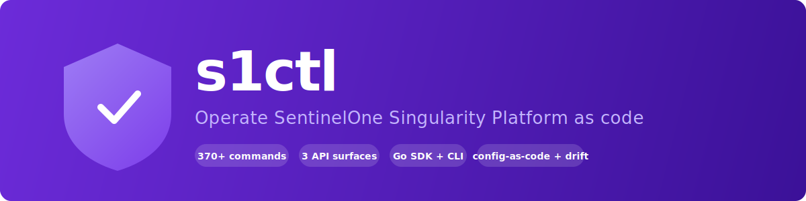

<div align="center">

<a href="https://s1.danny.vn"></a>

# s1ctl

**Operate SentinelOne Singularity Platform as code — for *any* tenant.**

[Docs](https://s1.danny.vn) · [Catalog](docs/design/catalog.md) · [Releases](https://github.com/dannyota/s1ctl/releases)

</div>

---

A single Go binary **and** an importable Go SDK covering the REST Management
API (v2.1), Singularity Data Lake (REST + GraphQL), and four GraphQL domains
(alerts, xSPM, cloud security, DLP). The core loop is **pull live state →
review the `git diff` → push it back** — one reconcile engine, every surface,
with `drift` to verify. It's **tenant-neutral** (nothing baked in; everything
comes from config) and built for humans and LLM agents alike: deterministic
flags, `--json` everywhere, clear `--help`, and an embedded agent operating
guide (`s1ctl skill`).

> **⚠️ Every mutation is dry-run by default.** Nothing changes until you pass
> `--yes`. Always preview, read it, then apply.

## What it does

- **Config as code** — `pull` → `git diff` → `push` across 11 surfaces
  (exclusions, blocklist, rules, firewall, network quarantine, device control,
  sites, groups, tags, locations, cloud policies), reconciled by one engine
  that skips unchanged objects and exits non-zero on failures.
- **Drift detection** — `s1ctl drift` compares committed config against live
  state and exits non-zero on any difference. Plug it into CI to catch
  console-side changes.
- **Full platform administration** — agents (36 actions), threats (18 verbs),
  alerts, sites, groups, accounts, policies, users, service users, RBAC roles,
  settings (8 categories), upgrade policies, filters, locations, tag rules,
  maintenance windows, remote operations (scripts, approvals, guardrails),
  reports, IOCs, and more.
- **Cloud and vulnerability management** — cloud policies, CNS custom rules
  (create, evaluate Rego), DLP rules and classifications, xSPM
  misconfigurations and vulnerabilities (with notes, assignment, history, CVE
  queries, stats, and CSV export).
- **Data lake** — powerquery, basic/facet/timeseries/numeric queries, event
  ingestion, file management, dashboards, and saved searches.
- **Built for agents** — a hard read-only mode (`S1_READONLY=1`), a
  machine-readable command catalog (`s1ctl commands --json`), a local mutation
  audit log (`~/.s1ctl/audit.jsonl`), secret-output notices on sensitive
  commands, and an embedded operating guide (`s1ctl skill` / `s1ctl skill
  install`) for LLM agent harnesses.

## Install

```bash
go install danny.vn/s1/cmd/s1ctl@latest
```

Requires Go ≥ 1.26. Prebuilt binaries (linux/macOS/windows, amd64/arm64)
are on the [Releases](https://github.com/dannyota/s1ctl/releases) page.

## Quickstart

```bash
s1ctl config init                              # interactive config wizard
s1ctl doctor                                   # verify auth + API reach
s1ctl commands --json                          # discover every verb
```

Set `S1_CONSOLE_URL` and `S1_TOKEN` as environment variables, or let the
wizard write `~/.s1ctl/config.yaml`.

## CLI usage

```bash
# Read
s1ctl agents list --site-id 000000 --json
s1ctl threats list --status active --all
s1ctl alerts list --json
s1ctl vulnerabilities cves --json
s1ctl datalake powerquery --query "endpoint.name contains 'srv'" --from 24h

# Mutate (dry-run first, --yes to apply)
s1ctl agents isolate 000000                    # preview
s1ctl agents isolate 000000 --yes              # apply
s1ctl threats mitigate 000000 --action remediate --yes

# Config-as-code
s1ctl firewall pull --out firewall/            # snapshot live rules
git diff firewall/                              # review
s1ctl firewall push --dir firewall/ --yes      # deploy creates + updates
s1ctl drift                                     # verify: exit 0 = clean
```

Every read command supports `--json` and `--output csv`.

## Go SDK

Three independently importable packages — pure API, typed structs, no file I/O:

```go
import "danny.vn/s1/mgmt"

client := mgmt.NewClient("https://your-console.sentinelone.net", token)
agents, _, err := client.AgentsList(ctx, nil)
```

```go
import "danny.vn/s1/graphql"

client := graphql.NewClient("https://your-console.sentinelone.net", token)
alerts, err := client.AlertsList(ctx, &graphql.ListParams{First: 10})
cves, err := client.CvesList(ctx, nil, nil, &graphql.CvePage{First: 50})
```

```go
import "danny.vn/s1/sdl"

client := sdl.NewClient("https://your-sdl-host.sentinelone.net", token)
resp, err := client.PowerQuery(ctx, &sdl.PowerQueryRequest{
    Query: "endpoint.name contains 'srv'", StartTime: "24h",
})
```

## API coverage

| Surface | Package | Methods | CLI groups |
|---------|---------|---------|------------|
| REST MGMT v2.1 | `danny.vn/s1/mgmt` | 250+ | agents, threats, sites, groups, accounts, policies, exclusions, blocklist, rules, settings, users, service-users, roles, firewall, network, devicecontrol, reports, tags, activities, iocs, remoteops, filters, locations, tag-rules, maintenance, upgrade-policies, updates, applications, detection-library, ranger-ad |
| SDL (Data Lake) | `danny.vn/s1/sdl` | 20+ | datalake (powerquery, query, numeric, facet, timeseries, ingest, files, dashboards, saved-queries) |
| GraphQL | `danny.vn/s1/graphql` | 80+ | alerts, misconfigurations, vulnerabilities, cloud-policies, cloud-rules, dlp, assets |

370+ CLI commands across 48 groups. Run `s1ctl commands --json` for the
full live catalog.

## Agent integration

```bash
s1ctl skill                    # print the embedded operating guide
s1ctl skill --json             # structured {name, description, body}
s1ctl skill install            # write to ~/.claude/skills/s1ctl/ for auto-detection
```

The guide covers the mutation ritual, config-as-code loop, secret-output
conventions, self-discovery commands, and common recipes.

## Documentation

Full docs at [s1.danny.vn](https://s1.danny.vn).

## License

MIT
