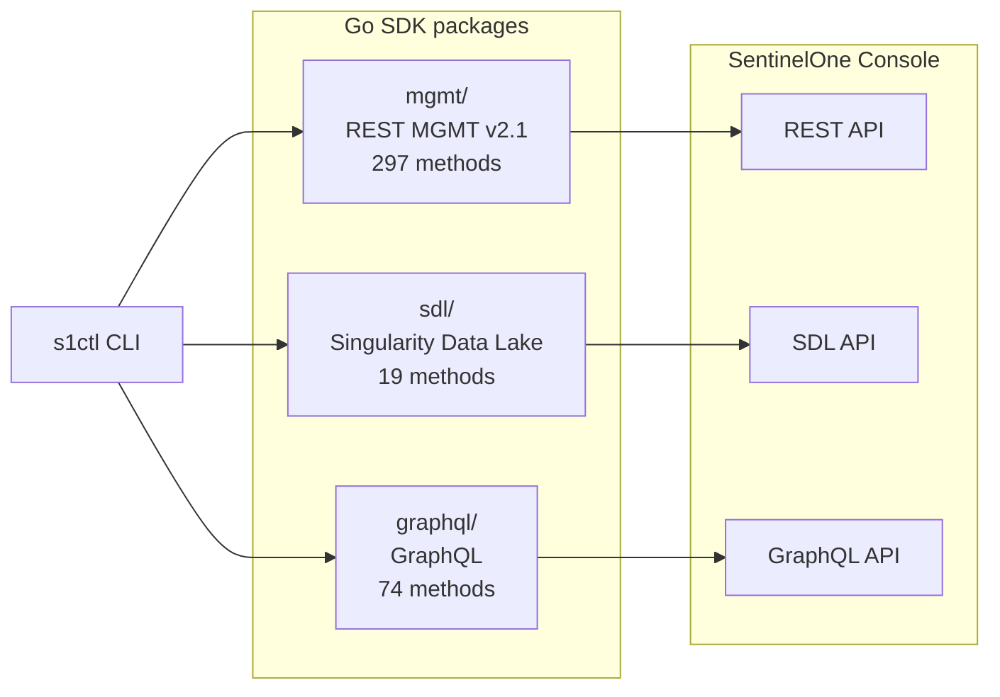

# Architecture

s1ctl is an **SDK-first** project: the Go SDK packages are the product, the CLI
is a thin consumer. Both ship together.

## SDK packages

```text
danny.vn/s1/mgmt      REST MGMT client (297 methods across 40+ resources)
danny.vn/s1/sdl       SDL Data Lake client (19 methods: REST + GraphQL)
danny.vn/s1/graphql   GraphQL client (74 methods across 6 domains)
danny.vn/s1/auth      Token management (shared by all three)
danny.vn/s1/config    Instance config resolution
```

Each package is independently importable:

```go
import "danny.vn/s1/mgmt"

client := mgmt.NewClient("https://your-console.sentinelone.net", token)
agents, _, err := client.AgentsList(ctx, nil)
```

The SDK packages are **pure** — HTTP calls and typed structs, no disk I/O. All
on-disk layout (pull/push file trees, config files) lives in `internal/`.

## Three protocols, one CLI

SentinelOne exposes three API protocols. The CLI unifies them under one command
tree — users never think about which protocol is underneath.



| Protocol | Package | Auth header | Scope |
|----------|---------|-------------|-------|
| REST MGMT v2.1 | `mgmt/` | `ApiToken <token>` | Agents, threats, sites, groups, exclusions, policies, remote ops |
| SDL | `sdl/` | `Bearer <token>` | PowerQuery, log ingest/query, file ops |
| GraphQL | `graphql/` | `Bearer <token>` | UAM alerts, xSPM vulns/misconfigs, cloud security |

## Protocol selection

When a surface is available via multiple protocols (e.g. alerts via both REST
and GraphQL), s1ctl defaults to the protocol with the best performance and
richest filtering. Users can override with `--protocol rest|graphql|sdl`.

Each command's `--help` documents which protocol is the default and why.

## Two planes

| Plane | Loop | Source of truth | Surfaces |
|-------|------|-----------------|----------|
| **Control** | pull &rarr; `git diff` &rarr; push | Git | Exclusions, custom rules, policies, firewall, device control, network quarantine, sites, groups, tags, blocklist, locations, cloud policies |
| **Operational** | query &rarr; review &rarr; act | Live instance | Agents, threats, alerts, vulns, misconfigs, data lake, remote ops, inventory |

Control plane is narrow — most of SentinelOne is operational. Config-as-code
surfaces share one reconcile model (see [Reconcile engine](reconcile.md)):
per-object files, surface-defined identity, canonical diff, dry-run by
default, `--yes` to apply.

## SDK strategy

The SDK is hand-written, covering ~390 public methods across 3 packages. Each
method is crafted against the API reference specs under `references/`.

| Surface | Package | Methods | Reference |
|---------|---------|---------|-----------|
| REST MGMT | `mgmt/` | 297 | `references/rest/swagger_2_1.json` |
| GraphQL | `graphql/` | 74 | `references/graphql/*.graphql` |
| SDL | `sdl/` | 19 | `references/sdl/*.md` |

## CLI structure

Commands follow SentinelOne's official terminology. Plural nouns at the top
level, verbs nested underneath.

```text
s1ctl agents list|get|isolate|scan|...
s1ctl threats list|get|mitigate|...
s1ctl alerts list|get|...
s1ctl exclusions list|get|pull|push|...
s1ctl datalake query|powerquery|...
s1ctl config init|show
s1ctl doctor
s1ctl mcp serve|install
```

### Cross-cutting flags

| Flag | Scope | Default |
|------|-------|---------|
| `--output` | All read commands | `table` (also `json`, `csv`; `--json` is shorthand) |
| `--yes` | All mutations | false (dry-run) |
| `--site-id` | Most commands | from config |
| `--limit`, `--all` | List commands | API default |
| `--no-progress`, `--verbose` | All | false |
| `--config` | All | `~/.s1ctl/config.yaml` |

Full command naming conventions in [CLI naming](cli-naming.md). Domain-to-API
mapping in [Surfaces](surfaces.md). Implementation status in
[Catalog](catalog.md).
