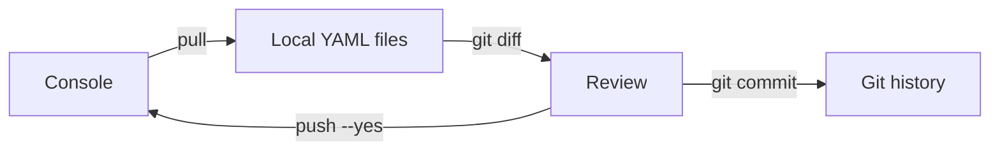
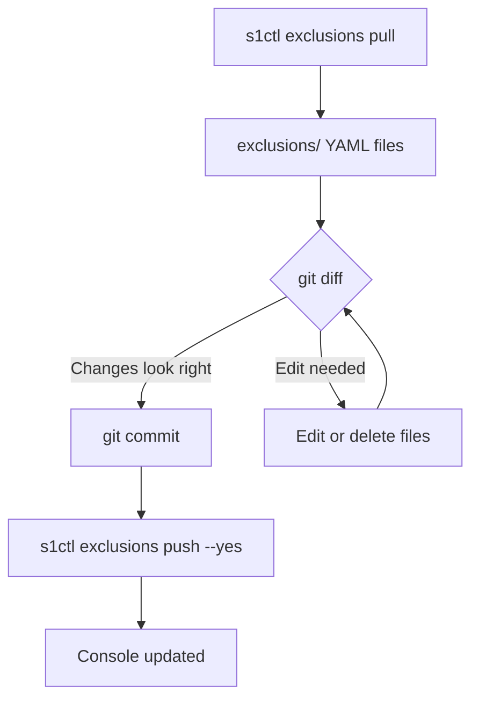

# Exclusions

Manage SentinelOne exclusions (allowlist entries) as code: list, inspect, pull
to local files, review in git, and push back.

## The config-as-code loop



Pull the live exclusions to local YAML files, review the diff, commit to git for
audit history, then push changes back. Every mutation is dry-run by default --
pass `--yes` to apply.

## List exclusions

```bash
s1ctl exclusions list
```

Filter by site, type, or OS:

```bash
s1ctl exclusions list --site-id 000000
s1ctl exclusions list --type path --os-type windows
s1ctl exclusions list --query "chrome" --limit 20
s1ctl exclusions list --all --json
```

| Flag | Description |
|------|-------------|
| `--site-id` | Filter by site ID (repeatable) |
| `--type` | Filter by exclusion type (repeatable): `path`, `white_hash`, `certificate`, `browser`, `file_type` |
| `--os-type` | Filter by OS type (repeatable): `windows`, `macos`, `linux` |
| `--query` | Free text search |
| `--sort-by` | Sort field (e.g. `type`, `osType`) |
| `--sort-order` | Sort direction (`asc`, `desc`) |
| `--limit` | Max results per page (default 50) |
| `--all` | Fetch all pages |
| `--cursor` | Pagination cursor for manual paging |
| `--json` | Machine-readable output |

Table columns: ID, Type, Value, OS, Mode.

## Get exclusion details

```bash
s1ctl exclusions get 000000
```

Returns: ID, type, value, OS, mode, description, scope name, user, and
creation date.

## Pull exclusions

Download all exclusions matching the given filters to a directory of
per-exclusion YAML files:

```bash
s1ctl exclusions pull --site-id 000000
```

| Flag | Description |
|------|-------------|
| `--site-id` | Filter by site ID (repeatable) |
| `--out` | Output directory (default `exclusions`) |

The command auto-paginates (fetches all pages) and writes one YAML file per
exclusion under `<out>/`.

```bash
# Pull to the default exclusions/ directory
s1ctl exclusions pull --site-id 000000

# Pull to a custom directory
s1ctl exclusions pull --site-id 000000 --out snapshots/prod
```

## Push exclusions

Sync exclusions from a local directory. Exclusions are matched by type + OS +
value: matching files update, new files create, and live-only entries are
reported. Dry-run by default:

```bash
# Preview what would change
s1ctl exclusions push --site-id 000000

# Apply
s1ctl exclusions push --site-id 000000 --yes
```

| Flag | Description |
|------|-------------|
| `--dir` | Input directory (default `exclusions`) |
| `--site-id` | Scope for new exclusions (default: global/tenant) |
| `--yes` | Apply changes (default: dry-run) |

Failed entries log a warning and continue -- the command does not abort on the
first error, and exits non-zero if any item failed.

## Pull, diff, push workflow

The core loop for managing exclusions as code:



### Step by step

1. Pull the current exclusions from the console:

   ```bash
   s1ctl exclusions pull --site-id 000000
   ```

2. Review the diff against the last committed version:

   ```bash
   git diff exclusions/
   ```

3. Add, delete, or edit files if changes are needed.

4. Commit the snapshot to git:

   ```bash
   git add exclusions/
   git commit -m "exclusions: update path exclusions for site 000000"
   ```

5. Push the updated exclusions back to the console:

   ```bash
   s1ctl exclusions push --site-id 000000 --yes
   ```

### Why this matters

- **Audit trail.** Every exclusion change is a git commit with author, date, and
  diff.
- **Review gate.** The dry-run default prevents accidental mutations.
- **Rollback.** Revert a commit and push again to undo a change.

## Workflows

### Audit exclusions across sites

Pull exclusions from multiple sites and compare:

```bash
s1ctl exclusions pull --site-id 111111 --out site-a
s1ctl exclusions pull --site-id 222222 --out site-b
diff -r site-a site-b
```

### Export all exclusions as JSON

```bash
s1ctl exclusions list --all --json > all-exclusions.json
```

### Count exclusions by type

```bash
s1ctl exclusions list --all --json \
  | jq 'group_by(.type) | map({type: .[0].type, count: length})'
```

### Find path exclusions on a specific OS

```bash
s1ctl exclusions list --type path --os-type windows --all --json \
  | jq '.[] | {id, value, mode}'
```

### Copy exclusions between sites

Pull from one site and push to another:

```bash
s1ctl exclusions pull --site-id 111111
s1ctl exclusions push --site-id 222222          # dry-run first
s1ctl exclusions push --site-id 222222 --yes    # apply
```
