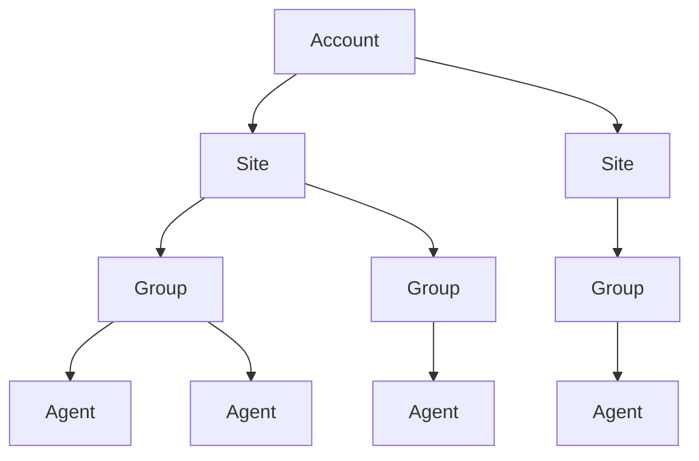

# Sites and groups

Navigate the SentinelOne management hierarchy: accounts, sites, groups, and
their policies.

## Hierarchy



Every SentinelOne deployment follows this tree:

| Level | Description |
|-------|-------------|
| Account | Top-level tenant. Owns licenses, sites, and global policies. |
| Site | Logical boundary (business unit, region, environment). Holds groups. |
| Group | Collection of agents sharing a policy. Every site has a default group. |
| Agent | Endpoint running the SentinelOne agent. Belongs to exactly one group. |

Policies inherit downward: account policy applies to all sites unless a site
overrides it, and group policies override the site.

## Accounts

### List accounts

```bash
s1ctl accounts list
```

Filter and paginate:

```bash
s1ctl accounts list --state active
s1ctl accounts list --query "prod" --limit 10
s1ctl accounts list --all
```

| Flag | Description |
|------|-------------|
| `--state` | Filter by state (repeatable) |
| `--query` | Free text search |
| `--limit` | Max results per page (default 50) |
| `--all` | Fetch all pages |
| `--cursor` | Pagination cursor for manual paging |
| `--json` | Machine-readable output |

### Get account details

```bash
s1ctl accounts get 000000
```

Returns: ID, name, state, type, license usage, site count, expiration, and
creation date.

## Sites

### List sites

```bash
s1ctl sites list
```

Filter by account, state, or search term:

```bash
s1ctl sites list --account-id 000000
s1ctl sites list --state active
s1ctl sites list --query "production" --limit 20
s1ctl sites list --all --json
```

| Flag | Description |
|------|-------------|
| `--account-id` | Filter by account ID (repeatable) |
| `--state` | Filter by state (repeatable) |
| `--query` | Free text search |
| `--sort-by` | Sort field (e.g. `name`, `state`) |
| `--sort-order` | Sort direction (`asc`, `desc`) |
| `--limit` | Max results per page (default 50) |
| `--all` | Fetch all pages |
| `--cursor` | Pagination cursor for manual paging |
| `--json` | Machine-readable output |

Table columns: ID, Name, State, Type, Licenses (active / total).

### Get site details

```bash
s1ctl sites get 000000
```

Returns: ID, name, state, type, parent account, license usage, expiration, and
creation date.

### Create a site

Site mutations are **dry-run by default**; pass `--yes` to apply.

```bash
s1ctl sites create --account-id 000000 --name "New Site" --yes
```

| Flag | Description |
|------|-------------|
| `--account-id` | Account ID (required) |
| `--name` | Site name (required) |
| `--description` | Site description |
| `--site-type` | Site type |
| `--total-licenses` | Total licenses |
| `--unlimited-licenses` | Grant unlimited licenses |
| `--expiration` | Expiration timestamp (RFC 3339) |

### Update a site

Pass only the fields you want to change:

```bash
s1ctl sites update 000000 --name "Renamed Site" --yes
s1ctl sites update 000000 --total-licenses 500 --yes
```

### Delete a site

```bash
s1ctl sites delete 000000         # dry-run
s1ctl sites delete 000000 --yes    # apply
```

### Sites as code

Pull all sites (optionally filtered by account) to a directory of per-site
YAML files, review the diff in git, then push changes back:

```bash
s1ctl sites pull
s1ctl sites pull --account-id 000000
s1ctl sites push --yes
```

`sites pull` writes one file per site under `sites/`. `sites push` matches
sites by name: existing sites are updated, new ones created. See
[Config-as-code](config-as-code.md) for the shared reconcile model.

## Groups

### List groups

```bash
s1ctl groups list
```

Filter by site:

```bash
s1ctl groups list --site-id 000000
s1ctl groups list --site-id 000000 --query "servers"
s1ctl groups list --all --json
```

| Flag | Description |
|------|-------------|
| `--site-id` | Filter by site ID (repeatable) |
| `--query` | Free text search |
| `--sort-by` | Sort field (e.g. `name`, `type`) |
| `--sort-order` | Sort direction (`asc`, `desc`) |
| `--limit` | Max results per page (default 50) |
| `--all` | Fetch all pages |
| `--cursor` | Pagination cursor for manual paging |
| `--json` | Machine-readable output |

Table columns: ID, Name, Type, Agents, Default, Site.

### Get group details

```bash
s1ctl groups get 000000
```

Returns: ID, name, type, agent count, default flag, site ID, and creation date.

### Create a group

Group mutations are **dry-run by default**; pass `--yes` to apply.

```bash
s1ctl groups create --site-id 000000 --name "Servers" --yes
```

| Flag | Description |
|------|-------------|
| `--site-id` | Site ID (required) |
| `--name` | Group name (required) |
| `--description` | Group description |

### Update a group

```bash
s1ctl groups update 000000 --name "Renamed Group" --yes
```

### Delete a group

```bash
s1ctl groups delete 000000         # dry-run
s1ctl groups delete 000000 --yes    # apply
```

### Groups as code

```bash
s1ctl groups pull
s1ctl groups pull --site-id 000000
s1ctl groups push --yes
```

`groups pull` writes one file per group under `groups/`. `groups push` matches
groups by site ID + name: existing groups are updated, new ones created.

## Tags

Tags label firewall, network-quarantine, and device-inventory objects.

### List and get tags

```bash
s1ctl tags list --type firewall
s1ctl tags list --site-id 000000
s1ctl tags get 000000
```

| Flag | Description |
|------|-------------|
| `--type` | Tag type (`firewall`, `network-quarantine`, `device-inventory`) |
| `--site-id` | Filter by site ID (repeatable) |
| `--query` | Free text search |
| `--limit` | Max results per page (default 50) |
| `--all` | Fetch all pages |
| `--cursor` | Pagination cursor for manual paging |

### Create, update, delete

Tag mutations are **dry-run by default**; pass `--yes` to apply.

```bash
s1ctl tags create --key env --value production --yes
s1ctl tags update 000000 --value staging --yes
s1ctl tags delete 000000 --yes
```

| Flag | Description |
|------|-------------|
| `--key` | Tag key (required on create) |
| `--value` | Tag value (required on create) |
| `--description` | Tag description |
| `--scope` | Tag scope |
| `--scope-id` | Tag scope ID |

### Tags as code

```bash
s1ctl tags pull
s1ctl tags pull --site-id 000000
s1ctl tags push --yes
```

`tags pull` writes one file per tag under `tags/`. `tags push` matches tags by
key: existing tags are updated, new ones created.

## Policies

### Get a policy

Retrieve the endpoint policy for a given scope. Pass exactly one scope flag (or
`--site-id` plus `--group-id` for a group policy):

```bash
# Account-level policy
s1ctl policies get --account-id 000000

# Site-level policy
s1ctl policies get --site-id 000000

# Group-level policy (requires both flags)
s1ctl policies get --site-id 000000 --group-id 000000
```

| Flag | Description |
|------|-------------|
| `--account-id` | Account scope |
| `--site-id` | Site scope (also required for group scope) |
| `--group-id` | Group scope (requires `--site-id`) |

Output is always JSON -- the policy object is a large nested structure best
consumed by `jq`.

## Pagination

All list commands share the same pagination model:

- **`--limit N`** -- return at most N items per request (default 50).
- **`--cursor`** -- resume from a previous page's cursor.
- **`--all`** -- auto-paginate and return every item. Useful for exports and
  counts, but may be slow on large tenants.

When `--all` is not set, the footer shows `Showing X of Y total`. Pass `--json`
to get the raw array for scripting.

## Workflows

### Inventory all sites

```bash
s1ctl sites list --all --json | jq '.[] | {id, name, state}'
```

### Drill from account to agents

Walk the tree top-down:

```bash
# 1. Find the account
s1ctl accounts list --query "prod"

# 2. List sites under that account
s1ctl sites list --account-id 000000

# 3. List groups under a site
s1ctl groups list --site-id 000000

# 4. List agents in a group
s1ctl agents list --group-id 000000
```

### Compare policies across sites

Export two site policies and diff them:

```bash
s1ctl policies get --site-id 111111 > /tmp/policy-a.json
s1ctl policies get --site-id 222222 > /tmp/policy-b.json
diff /tmp/policy-a.json /tmp/policy-b.json
```

Compare a group policy against its parent site:

```bash
s1ctl policies get --site-id 000000 > /tmp/site-policy.json
s1ctl policies get --site-id 000000 --group-id 000000 > /tmp/group-policy.json
diff /tmp/site-policy.json /tmp/group-policy.json
```

### Count agents per site

```bash
s1ctl sites list --all --json \
  | jq -r '.[] | [.id, .name, .activeAgents // 0] | @tsv'
```

### Find empty groups

```bash
s1ctl groups list --all --json \
  | jq '.[] | select(.totalAgents == 0) | {id, name, siteId}'
```
