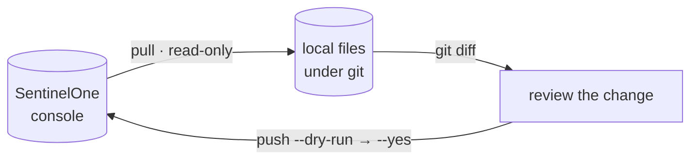
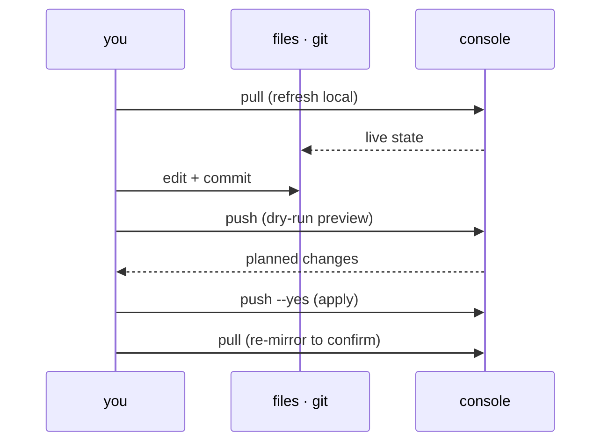

# The loop

Core mental model: pull live state to local files, review the change in
`git diff`, push it back. The git history is the source of truth and the
review surface.



Prerequisite: a resolved config and working auth — see
[configure.md](configure.md), then `s1ctl doctor`.

## Two planes

| Plane | How it works | Source of truth | Examples |
|-------|--------------|-----------------|----------|
| **Control** | pull &rarr; `git diff` &rarr; push | Git | Exclusions, rules, firewall, sites |
| **Operational** | list/get &rarr; review &rarr; act | Live console | Agents, threats, alerts, vulns |

Most of SentinelOne is operational. The config-as-code loop covers exclusions,
rules, firewall, device control, sites, groups, tags, policies, and cloud
policies — see [config-as-code.md](config-as-code.md).

## Pull (read-only)

Mirror live state into files. `pull` never mutates the console.

```bash
s1ctl exclusions pull --site-id 000000
```

Files land in a surface-named directory (`exclusions/`) by default. Run from
inside a git repo so the mirror is diffable and committable.

## Review, then push

Every `push` is a mutation against a live console. Dry-run is the default;
`--yes` applies.

```bash
git diff exclusions/                             # review what changed
s1ctl exclusions push --site-id 000000           # dry-run (default)
s1ctl exclusions push --site-id 000000 --yes     # apply for real
```

Pull &rarr; `git diff` &rarr; push is the whole loop. Never skip the diff.

To check the committed mirror against the console without pulling, run
`s1ctl drift`: it reports per-surface drift and exits non-zero when any surface
diverges, which makes it a natural CI gate.



After any live mutation, re-pull the affected surface so the local mirror
matches the console.

## Observe: read commands

Read commands are the observe side of operational work. They never mutate.

| Verb | What it does |
|------|--------------|
| `list` | Paginated listing with filters |
| `get` | Single item by ID |
| `count` | Total count (agents) |
| `query` / `powerquery` | Data lake search |

```bash
s1ctl agents list --limit 10
s1ctl threats list --limit 5
s1ctl alerts list --limit 10
s1ctl datalake powerquery --query "endpoint.name contains 'srv'"
```

Every read command supports `--json` for machine-readable output.

## Respond: action commands

Action commands are the respond side — mutations against live objects. All are
dry-run by default; pass `--yes` to apply.

| Action | Surface | What it does |
|--------|---------|--------------|
| `isolate` / `connect` | agents | Network isolation / reconnect |
| `scan` | agents | Trigger a full disk scan |
| `decommission` | agents | Remove agent from console |
| `mitigate` | threats | Kill, quarantine, remediate, or rollback |
| `verdict` | threats, alerts | Mark as true/false positive |
| `status` | threats, alerts | Update incident status |

```bash
s1ctl agents isolate --id 000000          # dry-run
s1ctl agents isolate --id 000000 --yes    # apply

s1ctl threats mitigate --id 000000 --action kill --yes
```

## Connectivity check

Run `s1ctl doctor` before starting. It validates your config, token, and
console connectivity.

```bash
s1ctl doctor
```

## See also

- [configure.md](configure.md) — config and auth setup
- [quickstart.md](quickstart.md) — common workflows
- [sdk.md](sdk.md) — using the Go SDK directly
- [../design/architecture.md](../design/architecture.md) — how the CLI is built
- [../design/catalog.md](../design/catalog.md) — per-surface implementation status
